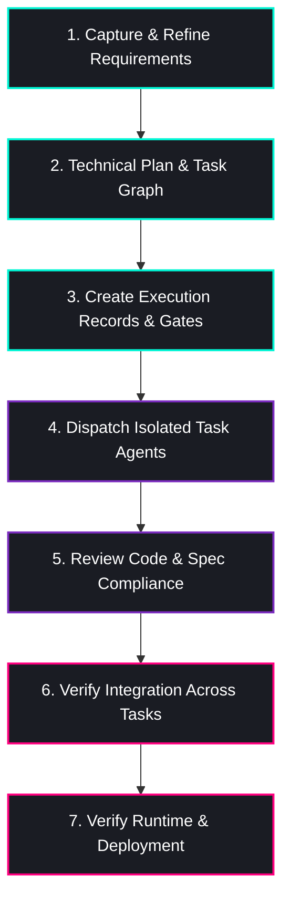

# Dev Manager

<p align="center">
  
</p>

<p align="center">
  <strong>Workflow-first software delivery skills for development agents.</strong>
</p>

<p align="center">
  <a href="README.zh-TW.md">🇹🇼 中文版 README</a> │
  <a href="https://github.com/cainmaila/dev-manager">🐙 GitHub Repository</a>
</p>

---

> [!NOTE]
> This repository is built for developers who want more than fast code generation. It provides a set of skills that push an agent through the real work of software delivery: clarifying requirements, planning execution, isolating tasks, reviewing outputs, and verifying that the system actually works.
>
> These skills are designed to **make an agent more reliable under real project pressure**, not just more impressive in a single prompt.

## 📦 Installation

Install this package using the **Skills CLI**:

```bash
npx skills add cainmaila/dev-manager
```

#### 💡 Useful Variants

- **Install from the GitHub URL:**
  ```bash
  npx skills add https://github.com/cainmaila/dev-manager
  ```
- **Install globally instead of project-level:**
  ```bash
  npx skills add cainmaila/dev-manager -g
  ```

---

## 🚀 Example: Start from a product wish

Dev Manager is meant to be useful before you have a full spec. You can start with a rough wish in your agent chat:

> **User Wish:**
> _"I want to build a small internal tool that turns meeting notes into action items, assigns owners, and sends a daily summary to Slack. Use Dev Manager to take this from requirements to implementation."_

### ⚡ What Happens Next?

1. **Clarify**: Dev Manager starts by clarifying requirements and acceptance criteria.
2. **Document**: It turns those answers into a saved requirements document.
3. **Plan**: It uses the planner skills to create a spec, task breakdown, and execution plan.
4. **Execute**: It dispatches focused implementation work through isolated task agents.
5. **Verify**: It verifies reviews, integration, and runtime behavior before claiming completion.

### 💬 Typical Interaction Flow

<details open>
<summary><b>Click to expand typical early interaction</b></summary>
<br />

> 👤 **You:** I want to build a small internal tool that turns meeting notes into action items.
>
> 🤖 **Agent:** Who will use it first: only your team, multiple departments, or external customers?
>
> 👤 **You:** Only my team.
>
> 🤖 **Agent:** Do you want note ingestion from pasted text first, or from uploaded files too?
>
> 👤 **You:** Pasted text first. Files can wait.
>
> 🤖 **Agent:** Good. I will keep the first release scoped to pasted text, action item extraction, owner assignment, and a Slack daily summary.

</details>

---

Once the requirements are stable, save them to disk and the workflow moves forward:

> 🤖 **Agent:** Requirements are complete. Please save the requirements document and give me the path, for example `./requirements.md`.
>
> 👤 **You:** Saved at `./requirements.md`

From there, Dev Manager continues into planning and execution instead of jumping straight into uncontrolled coding.

---

## 🔍 Why This Exists

Most development agents can write code quickly. **That is not the hard part.**

The hard part is turning a vague idea into software that is actually scoped, reviewed, testable, and ready to ship. In practice, projects usually break down because the workflow is weak, not because the model cannot produce code.

> [!IMPORTANT]
>
> ### ⚠️ Common Failure Modes in Agentic Coding
>
> - 🚦 **Premature Coding**: Coding starts before the requirements are stable.
> - 🌪️ **Context Bloat**: One large prompt turns into a messy, hard-to-review change.
> - 💥 **Task Interference**: Multiple parallel tasks step on each other's toes.
> - 🤥 **False Completion**: "Done" means code was written, not that the system actually works.
> - 🧪 **Skipped Tests**: Testing is partial, late, or skipped entirely.
> - 🏚️ **Environment Failures**: The final result looks plausible in chat but fails in the real environment.

Dev Manager is built to close that gap.

---

## ✨ What Makes It Different

Instead of treating software development like one long coding conversation, Dev Manager treats it as a delivery workflow with explicit phases and evidence.

| 🎯 Area                 | 🤖 Typical Development Agent        | 🛡️ Dev Manager                                              |
| :---------------------- | :---------------------------------- | :---------------------------------------------------------- |
| **Primary job**         | Generate code quickly               | Orchestrate delivery from idea to verified output           |
| **Starting point**      | Jump into implementation            | Clarify requirements and acceptance criteria first          |
| **Task shape**          | Large prompts with fuzzy boundaries | Small, explicit, independently verifiable tasks             |
| **Parallel work**       | Shared context, shared risk         | Isolated task ownership and controlled handoffs             |
| **Review model**        | Optional or ad-hoc                  | Structured review gates for scope and quality               |
| **Verification**        | Often limited to a quick test run   | Evidence-based checks across task, integration, and runtime |
| **Completion standard** | "Looks done"                        | Proved by artifacts, tests, review, and verification        |

---

## 🛠️ Problems It Solves

Dev Manager is for developers who have run into these common frustrations:

- 🗣️ _"I have an idea, but the agent starts coding before the problem is fully defined."_
- ❓ _"The result kind of works, but I cannot tell whether it is actually complete."_
- 📦 _"A single large prompt created too much code at once and now the change is hard to inspect."_
- 🚧 _"Parallel work keeps stepping on itself."_
- 💥 _"The agent says the task is done, but the app still fails when it actually runs."_
- 📝 _"I need inspectable outputs and checkpoints, not just confident chat responses."_

---

## 🔄 Core Workflow

The repository is organized around a practical software delivery flow:



1. **Capture and refine requirements** (Clarification)
2. **Turn requirements into a technical plan and task graph** (Planning)
3. **Create execution records and environment readiness gates** (Preparation)
4. **Dispatch focused implementation agents with isolated task scope** (Execution)
5. **Review each task for spec compliance and code quality** (Review)
6. **Verify integration across tasks** (Integration Verification)
7. **Verify runtime or deployment behavior before claiming completion** (System Verification)

> [!NOTE]
> This is carefully designed to **reduce chaos and project risk**, not to add unnecessary ceremony for its own sake.

---

## 🧰 Included Skills

Key skills in this repository include:

| 🧠 Skill Name              | 📝 Purpose & Description                                                          |
| :------------------------- | :-------------------------------------------------------------------------------- |
| `requirements-interviewer` | Turns vague requests into explicit requirements and acceptance criteria           |
| `dev-task-planner`         | Converts requirements into a spec, task breakdown, and execution-ready work items |
| `dev-manager` | Acts as a non-coding orchestrator across the full delivery lifecycle |
| `dev-change-manager` | Manages software change requests (CR), bug fixes, and feature modifications on an existing codebase |
| `senior-engineer` | Executes one focused implementation task with test-first discipline |
| `deployment-verifier`      | Checks whether the finished system actually starts and behaves correctly          |
| `dev-doc-cleaner`          | Audits and cleans stale dev-manager documents in a project root                   |

Together, these skills aim to make agentic development more controlled, auditable, and useful in real projects.

---

## 🔄 Tool Spotlight: `dev-change-manager`

> [!TIP]
> **When to use:** Use this skill when you want to modify, refactor, or fix bugs in an existing codebase, rather than starting a new project from scratch. It structures the **Change Request (CR)** workflow to ensure updates do not break existing features.

### 💻 How to Invoke

```text
/dev-change-manager [change instruction]
```

---

## 🧹 Tool Spotlight: `dev-doc-cleaner`

> [!TIP]
> **When to use:** Use this tool after a project has accumulated stale task records, superseded change requests, or conflicting planning documents. Run it when `TASKS.md`, change request files, or `MANAGER_STATE.md` are out of sync with the actual project state.

### 💻 How to Invoke

```text
/dev-doc-cleaner ./my-project
```

### 🔍 What It Does

1. **Scans**: Analyzes all `dev-manager` and `dev-change-manager` documents under the given project root.
2. **Classifies**: Classifies each document as _Current_, _Stale_, _Obsolete_, or _Conflict_.
3. **Previews**: Generates and shows you a detailed cleanup plan — **no files are touched** until you confirm.
4. **Executes**: Resolves conflicts, compacts `TASKS.md`, archives obsolete files, and deletes only what you explicitly approve.

> [!WARNING]
> **Safety First:** This tool runs in **read-only mode** until you explicitly type `confirm`. It also defaults to _archive_ rather than hard _delete_ to prevent accidental data loss.

---

## 👥 Who It Is For

Dev Manager is tailored for developers and teams seeking stronger process safety:

- 🧑‍💻 **Solo Developers** who want stronger engineering discipline without adding heavy process overhead.
- 🚀 **Product Builders** starting from vague ideas who want a more predictable, structured path to delivery.
- 🧪 **Experimenters** exploring multi-agent workflows and task isolation techniques.
- 👥 **Small Teams** seeking clearer checkpoints, cleaner task boundaries, and robust verification gates.

---

## 🎨 Design Principles

Dev Manager is designed based on five core pillars:

| 💎 Principle                           | 🎯 What it Means                                                              |
| :------------------------------------- | :---------------------------------------------------------------------------- |
| **Workflow over improvisation**        | Structured processes lead to higher quality than ad-hoc coding.               |
| **Evidence over confidence**           | System behavior must be verified by tests and logs, not just chat assertions. |
| **Small tasks over oversized prompts** | Break complex features down to avoid messy merge conflicts.                   |
| **Isolation over context sprawl**      | Task execution should happen in clean, focused environments.                  |
| **Delivery over demos**                | Code is only complete when it builds, passes tests, and runs in target env.   |

---

## 🏁 Getting Started

> [!IMPORTANT]
> This repository is a **skill library**, not a standalone application.

To use it effectively in your agentic loops:

1. **Explore the Skills**: Start by browsing the available skills inside the `skills/` directory.
2. **Orchestrate**: Use `dev-manager` when you want robust, end-to-end delivery orchestration.
3. **Delegate**: Utilize `senior-engineer` strictly as a task executor, rather than as a project-level planner.
4. **Adapt**: Customise and adapt these skills to your specific agent harness and development workflow conventions.

---

_If your goal is not just to generate code, but to **deliver reliable software** with clearer boundaries and stronger verification, this repository is built for that job._
