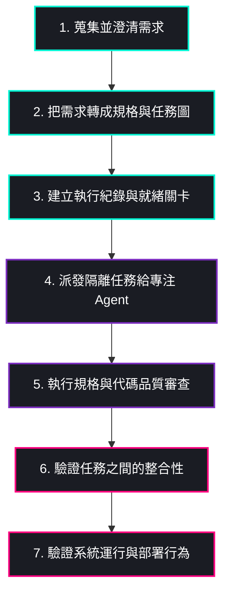

# Dev Manager

<p align="center">
  
</p>

<p align="center">
  <strong>以工作流程為核心的軟體開發 Agent 交付技能包，也可以把它理解成一位 AI 專案經理。</strong>
</p>

<p align="center">
  <a href="README.md">🇺🇸 English README</a> │ 
  <a href="https://github.com/cainmaila/dev-manager">🐙 GitHub Repository</a>
</p>

---

> [!NOTE]
> 這個倉庫不是為了讓 Agent 單純把程式碼寫得更快，而是讓它拥有一套**真正能交付軟體的開發流程**。它提供一組技能，讓 Agent 從需求釐清、技術規劃、任務切分、隔離實作、代碼審查，到最終系統驗證，形成一條更完整的交付路徑。
> 
> 它的目標不是讓 Agent 在單次對話裡看起來很厲害，而是讓它在真實專案裡**更可控、更可驗證、更值得信任**。

## 📦 使用 pnpm/npx 安裝

使用 **Skills CLI** 安裝這個技能包：

```bash
npx skills add cainmaila/dev-manager
```

#### 💡 常見變體

* **直接以 GitHub 網址安裝：**
  ```bash
  npx skills add https://github.com/cainmaila/dev-manager
  ```
* **安裝為全域技能，而不限於目前專案：**
  ```bash
  npx skills add cainmaila/dev-manager -g
  ```

---

## 🚀 使用範例：從需求願望開始

Dev Manager 的設計重點之一，就是您不需要先準備好完整規格，只有一個粗略的產品願望也可以啟動。

您可以在 Agent 對話中這樣開場：

> **使用者願望：**
> *"我想做一個內部工具，可以把會議記錄整理成待辦事項、指派負責人，並每天把摘要送到 Slack。請用 Dev Manager 幫我從需求一路做到實作。"*

### ⚡ 接下來通常會發生的事：

1. **釐清需求 (Clarify)**：Dev Manager 先幫您釐清需求與驗收標準。
2. **整理存檔 (Document)**：把您的回答整理成可存檔的需求文件。
3. **規劃任務 (Plan)**：使用規劃技能生成規格、任務拆解與執行計畫。
4. **隔離實作 (Execute)**：把實作拆分派發給範圍明確、彼此隔離的任務代理。
5. **整合驗證 (Verify)**：在宣稱完成前，檢查審查結果、整合情況與實際運行狀態。

### 💬 典型的前期對話流程

<details open>
<summary><b>點擊展開典型的前期對話流程</b></summary>
<br />

> 👤 **您：** 我想做一個內部工具，把會議記錄整理成待辦事項。
> 
> 🤖 **Agent：** 第一版是只有您的團隊會使用，還是會擴大到多個部門？
> 
> 👤 **您：** 先只有我的團隊使用。
> 
> 🤖 **Agent：** 第一版要先支援貼上文字就好，還是也要支援上傳檔案？
> 
> 👤 **您：** 先貼文字就好，檔案上傳之後再做。
> 
> 🤖 **Agent：** 了解。那第一版我會先把範圍收斂在：文字貼上、待辦抽取、負責人指派，以及 Slack 每日摘要。

</details>

---

當需求穩定後，您只要把需求文件存到磁碟，流程就會繼續往下走：

> 🤖 **Agent：** 需求已完整。請將需求文件存檔後提供路徑，例如 `./requirements.md`。
> 
> 👤 **您：** 我存好了，路徑是 `./requirements.md`

接著 Dev Manager 就會進入任務規劃、執行與驗證，而不是直接跳進一大段難以控制的寫碼流程。

---

## 🔍 為什麼會有這個倉庫

現在多數開發 Agent 的問題，不是寫不出程式，而是太容易、太快開始寫碼。

真正困難的地方，是把一個模糊想法穩定地變成**可規劃、可審查、可測試、可交付**的軟體。許多專案之所以失控，並不是因為模型不會產生程式碼，而是因為整個開發流程過於鬆散。

> [!IMPORTANT]
> ### ⚠️ 開發 Agent 常見的失敗情境
> * 🚦 **過早開發 (Premature Coding)**：需求還沒穩定就直接開始實作。
> * 🌪️ **上下文膨脹 (Context Bloat)**：一個大 prompt 一次改太多，最後難以理解與審查。
> * 💥 **任務衝突 (Task Interference)**：多個任務同時進行時，互相踩到彼此的程式碼變更。
> * 🤥 **偽完成 (False Completion)**：所謂完成，只代表「程式碼寫出來了」，不代表真的驗證過。
> * 🧪 **測試缺失 (Skipped Tests)**：測試做得太晚、太少，甚至完全被跳過。
> * 🏚️ **環境失敗 (Environment Failures)**：在對話裡看起來合理，但實際跑起來就崩潰。

Dev Manager 就是為了解決這一類痛點而生。

---

## ✨ 它和一般開發 Agent 有什麼不同

Dev Manager 不把軟體開發視為一段長 prompt 對話，而是將其視為一條**有階段、有交接、有證據**的交付流程。

| 🎯 面向 | 🤖 一般市面上的開發 Agent | 🛡️ Dev Manager |
| :--- | :--- | :--- |
| **主要目標** | 快速產生程式碼 | 從想法一路編排到可驗證交付 |
| **起手方式** | 直接進入實作 | 先釐清需求與驗收標準 |
| **任務切分** | 任務邊界常常模糊 | 任務小而清楚，可獨立驗證 |
| **平行開發** | 共用上下文，容易互相干擾 | 強調任務隔離、明確交接 |
| **審查方式** | 可有可無，或只靠人工補救 | 有明確的範圍與品質審查關卡 |
| **驗證方式** | 常停留在局部測試 | 強調任務、整合、執行層級的證據 |
| **完成定義** | 看起來差不多完成 | 必須有文件、測試、審查與驗證支持 |

---

## 🛠️ 它解決什麼問題

如果您對以下這些情境深有共鳴，這個倉庫就是為您準備的：

* 🗣️ *「我只有一個想法，但 Agent 太快開始寫，方向很容易歪掉。」*
* ❓ *「結果看起來能用，但我不知道到底有沒有真的做完。」*
* 📦 *「一次改太多檔案，後面根本不容易檢查與 Review。」*
* 🚧 *「平行處理多個任務時，程式碼常常彼此衝突或互相污染。」*
* 💥 *「Agent 說 Done，但實際啟動系統還是出錯。」*
* 📝 *「我需要的是可檢查的交付證據，不是很有自信的聊天回覆。」*

---

## 🔄 核心流程

這個倉庫圍繞一條務實的軟體交付流程設計：



1. **蒐集並澄清需求** (Clarification)
2. **把需求轉成技術規格與任務圖** (Planning)
3. **建立執行紀錄與環境就緒關卡** (Preparation)
4. **派發範圍清楚的實作任務給專注的 Agent** (Execution)
5. **對每個任務做規格符合性與程式品質審查** (Review)
6. **驗證任務之間的整合是否成立** (Integration Verification)
7. **在宣稱完成前，驗證系統實際執行或部署行為** (System Verification)

> [!NOTE]
> 這套流程的目的是**降低開發失控與專案風險**，而不是為了解決問題而徒增無意義的形式。

---

## 🧰 主要技能

這個倉庫的核心技能包含：

| 🧠 技能名稱 | 📝 用途與說明 |
| :--- | :--- |
| `requirements-interviewer` | 把模糊需求整理成明確需求與驗收標準 |
| `dev-task-planner` | 把需求轉成系統規格、任務拆解與可執行工作項目 |
| `dev-manager` | 用非寫碼主管的角色編排整條交付流程 |
| `senior-engineer` | 以測試優先與明確邊界執行單一實作任務 |
| `deployment-verifier` | 確認最後的系統是否真的能啟動並正確運作 |
| `dev-doc-cleaner` | 審查並清理指定專案根目錄下過時的 dev-manager 文件 |

這些技能組合起來的目標，是讓 Agent 開發流程更穩、更可審核，也更接近真實專案需要的交付方式。

---

## 🧹 工具亮點：`dev-doc-cleaner`

> [!TIP]
> **使用時機：** 專案跑了一段時間後，`TASKS.md`、CR 文件或 `MANAGER_STATE.md` 已出現大量過時紀錄、互相衝突的規劃文件，或已完成的任務模組堆積在目錄裡沒有整理時。

### 💻 呼叫方式

```text
/dev-doc-cleaner ./my-project
```

### 🔍 執行流程

1. **掃描 (Scan)**：掃描指定專案根目錄下所有 `dev-manager` 與 `dev-change-manager` 文件。
2. **分類 (Classify)**：將每份文件分類為 *Current* (保留)、*Stale* (待處理)、*Obsolete* (封存候選)、*Conflict* (需解決)。
3. **預覽 (Preview)**：列出清理計畫，讓您確認 —— **確認前不會變動任何檔案**。
4. **執行 (Execute)**：修復衝突 → 壓縮 `TASKS.md` → 封存過時文件 → 僅刪除您明確核准的項目。

> [!WARNING]
> **安全第一：** 本工具在輸入 `confirm` 前全程維持**唯讀模式**。且預設操作為 *封存 (Archive)* 而非直接 *刪除 (Delete)*，以防止意外的資料流失。

---

## 👥 適合誰使用

Dev Manager 特別適合以下尋求更高工程保障的開發者或團隊：

* 🧑‍💻 **個人開發者**：想保有開發速度，但不想放掉工程紀律者。
* 🚀 **產品建立者 (Builders)**：從模糊產品想法出發，希望有更穩定落地流程者。
* 🧪 **實驗性工程師**：想嘗試多 Agent 協作，但不想讓上下文和檔案變更失控者。
* 👥 **小型開發團隊**：想要更清楚任務邊界、檢查點與嚴格驗證流程者。

---

## 🎨 設計原則

Dev Manager 是基於以下五大支柱而設計：

| 💎 原則 | 🎯 核心涵義 |
| :--- | :--- |
| **流程優先於即興發揮** | 結構化的流程比臨時起意的寫碼更能產生高品質軟體。 |
| **證據優先於信心** | 系統的正確性必須由測試和運行日誌證明，而非僅憑口頭信心。 |
| **小任務優先於超大 Prompt** | 將複雜功能拆解，避免造成巨大的程式碼衝突。 |
| **隔離優先於上下文污染** | 任務的執行應保持環境乾淨且高度專注。 |
| **交付優先於展示** | 程式碼只有在能構建、通過測試並成功運行時，才算真正完成。 |

---

## 🏁 如何開始

> [!IMPORTANT]
> 這個倉庫是一套 **Skill 技能庫**，並非一個獨立執行的應用程式。

若想在您的 Agent 流程中高效使用：

1. **探索技能**：從 `skills/` 目錄內開始閱讀各個核心技能。
2. **全局協作**：想跑完整交付流程時，從 `dev-manager` 開始。
3. **派發實作**：把 `senior-engineer` 當成專注的任務執行者，而不是專案總控。
4. **因地制宜**：依照您採用的 Agent 平台與工作習慣調整這些技能。

---

*如果您要的不是「讓 Agent 幫您多寫一點 code」，而是「讓 Agent 更像一個能把軟體**穩定交付完成**的開發流程」，那這個倉庫就是朝這個方向打造的。*
